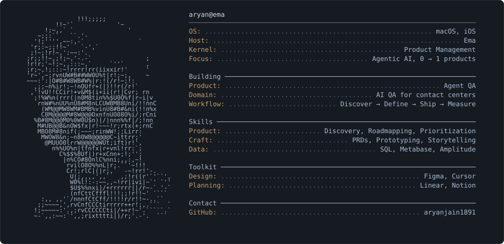

<!--
  Profile README for @aryanjain1891
  Repo must be named exactly: aryanjain1891   (README.md + assets/profile.svg at root)
  The whole card is one SVG. To edit the text, open assets/profile.svg in any editor,
  or edit build_card.py and regenerate.
-->

  

