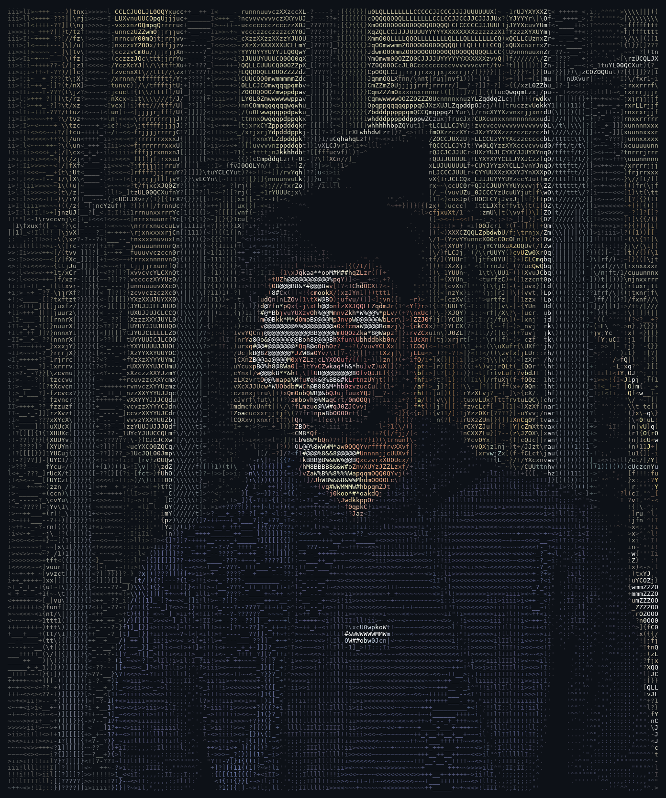
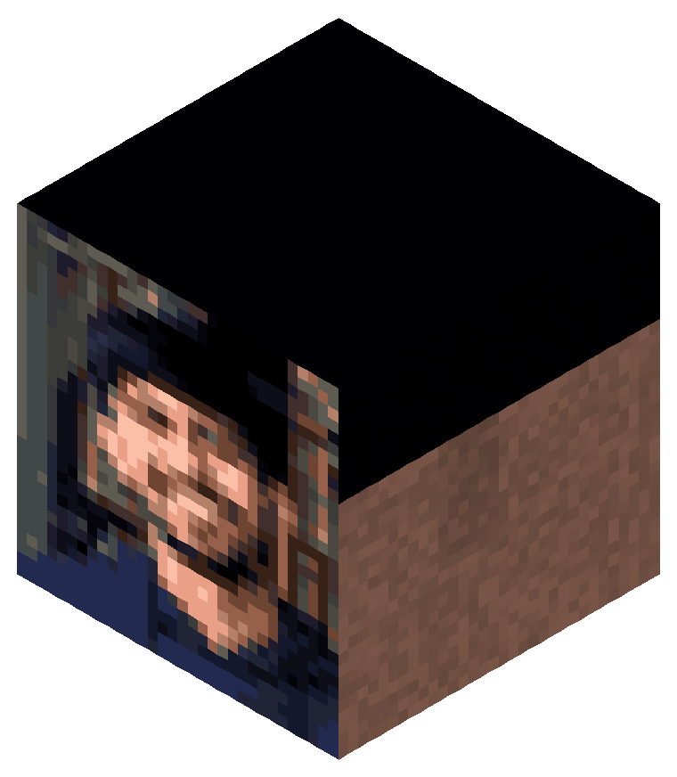

<!--
  ┌─────────────────────────────────────────────────────────────┐
  │  GitHub profile README for @aryanjain1891                     │
  │  To make it show on your profile:                             │
  │   1. Create a repo named exactly  aryanjain1891               │
  │   2. Commit this README.md + the /assets folder to its root   │
  │  Edit anything inside < > below — those are placeholders.     │
  └─────────────────────────────────────────────────────────────┘
-->

<table>
<tr>
<td valign="top" width="42%">

</td>
<td valign="top" width="58%">

<pre>
<b>aryan</b>@<b>ema</b>
-----------------------------------------
<b>OS</b>: ............ macOS · iOS · Notion-brained
<b>Uptime</b>: ........ &lt;X&gt; years shipping products
<b>Host</b>: .......... Ema — Agentic AI Employees
<b>Kernel</b>: ........ Product Management v5.0
<b>Title</b>: ......... Product Manager
<b>IDE</b>: ........... Figma · Linear · Notion · Cursor

<b>Skills.Product</b>: Discovery · Roadmapping · Prioritization
<b>Skills.Craft</b>: .. PRDs · Prototyping · Spec writing
<b>Skills.Data</b>: ... SQL · Amplitude · A/B testing
<b>Skills.Human</b>: .. Stakeholder wrangling · Storytelling

<b>Building</b>: ...... &lt;your current bet&gt;
<b>Learning</b>: ...... &lt;what you're digging into&gt;
<b>Ask.Me.About</b>: . 0→1 products · AI agents · PM craft
<b>Hobbies</b>: ....... &lt;fill me in&gt;

<b>Contact</b> ------------------------------
<b>Email</b>: ......... &lt;your.personal@email.com&gt;
<b>LinkedIn</b>: ...... linkedin.com/in/&lt;handle&gt;
<b>GitHub</b>: ........ aryanjain1891

<b>Stats</b> --------------------------------
<b>Focus</b>: ......... Turning ambiguity into roadmaps
<b>Coffee→Specs</b>: . 100% conversion rate
<b>Uptime.Mood</b>: .. 🟢 shipping
</pre>

</td>
</tr>
</table>

<!-- ─────────────  live GitHub stat cards (auto-update)  ───────────── -->

  
  

  

<!-- ─────────────  ⛏ minecraft mode  ───────────── -->

<h3 align="center">⛏ minecraft mode</h3>

  
  &nbsp;&nbsp;&nbsp;
  

  
  
  

